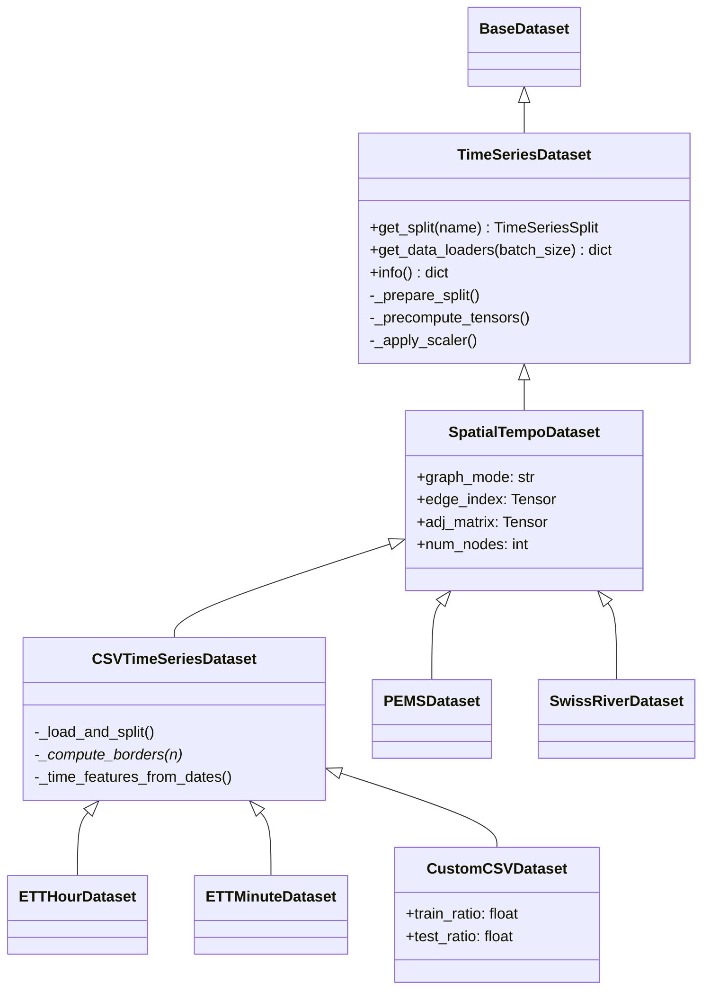

# Datasets

Catalog of all supported datasets with architecture, loading instructions,
and detailed technical notes on the TSL-compatible data pipeline.

---

## Class Hierarchy



**`TimeSeriesDataset`** is the core engine providing lazy windowing, gap
handling, noise injection, entity identifiers, and scaler support.
**`SpatialTempoDataset`** adds graph / spatial structure
(``graph_mode``, ``edge_index``, ``adj_matrix``) on top.
**`CSVTimeSeriesDataset`** adds CSV loading and border-based
train/val/test splitting.  Subclasses only need to override
`_compute_borders()` for custom split logic.

---

## Windowing: seq_len / label_len / pred_len

These three parameters define the sliding-window geometry, following the
[Time-Series-Library](https://github.com/thuml/Time-Series-Library) (TSL)
convention used by PatchTST, iTransformer, TimesNet, DLinear, and many others.

| Parameter | Default | Description |
|-----------|---------|-------------|
| `seq_len` | 96 | Encoder look-back context length |
| `label_len` | 48 | Decoder warm-up overlap (Transformer only) |
| `pred_len` | 96 | Prediction horizon |

### Window layout

```
Row indices (within data array):
   i           i+seq_len-label_len    i+seq_len    i+seq_len+pred_len
   |                    |                  |                |
   |--- encoder (seq_len) ------->|       |                |
                        |--- decoder (label_len+pred_len) --->|
                        |<- overlap ->|
```

In `__getitem__`:

```python
seq_x = data[i : i + seq_len]                              # encoder input
seq_y = data[i + seq_len - label_len : i + seq_len + pred_len]  # decoder target
```

At training time, the experiment code constructs the decoder input:

```python
dec_inp = cat([batch_y[:, :label_len, :], zeros(pred_len)])
# Ground-truth warm-up + zero placeholders for prediction
```

### Encoder-only and decoder-light models

Several models accept `(x_enc, x_mark_enc, x_dec, x_mark_dec)` for API
compatibility but ignore part or all of the decoder path during the
forecast forward pass. That means `label_len` often has no behavioral
effect even when the benchmark config still carries a non-zero value.

For strict TSL benchmark parity, many published `PatchTST` and `DLinear`
scripts still keep the dataset default decoder overlap (`48` for the
96-step benchmarks, `18` for ILI) even though the model does not use the
decoder warm-up. By contrast, the TSL `TimeMixer` scripts intentionally
set `label_len=0` across datasets, and we preserve that as a model-
specific convention.

### Encoder-decoder models (Informer, Autoformer, etc.)

Set `label_len > 0` (e.g. `label_len=48` for `seq_len=96`). The decoder
receives `label_len` ground-truth warm-up tokens followed by `pred_len`
zero placeholders.

---

## Features Modes: 'M' / 'MS' / 'S'

The `--features` flag controls column selection and output dimensionality:

| Mode | Input columns | Output columns | TSL `enc_in=dec_in=c_out` |
|------|-------------|----------------|---------------------------|
| **`M`** (Multivariate→Multivariate) | All non-date | All non-date | = num_channels |
| **`MS`** (Multivariate→Single) | All non-date | Target only | = num_channels |
| **`S`** (Single→Single) | Target only | Target only | = 1 |

### How MS mode works

In MS mode, `enc_in = dec_in = c_out = num_channels` — the model still
outputs all channels. The **target selection happens at loss time** via
the `f_dim` mechanism in the trainer:

```python
f_dim = -1 if features == 'MS' else 0
outputs = outputs[:, -pred_len:, f_dim:]  # MS: only last column
batch_y = batch_y[:, -pred_len:, f_dim:]
```

The target column is always reordered to be the **last** column in the
DataFrame, so `f_dim=-1` selects it correctly.

### TSL default

All standard TSL benchmark scripts use **`features='M'`** (Multivariate)
with `embed='timeF'` (continuous time features). The `MS` mode is only
used for specialized models like TimeXer that explicitly handle exogenous
variables. See the `scripts/long_term_forecast/` directory in TSL for
reference.

---

## Time Feature Encoding

Two time encoding modes are supported:

### `timeenc=1` (default — recommended)

Uses `liulian.utils.timefeatures.time_features()` (adapted from GluonTS).
Produces **continuous features normalised to `[-0.5, 0.5]`**:

| Frequency | Features | Dimensions |
|-----------|----------|:----------:|
| Hourly (`h`) | HourOfDay, DayOfWeek, DayOfMonth, DayOfYear | 4 |
| Minutely (`t`/`min`) | MinuteOfHour + above | 5 |
| Daily (`d`) | DayOfWeek, DayOfMonth, DayOfYear | 3 |
| Weekly (`w`) | DayOfMonth, WeekOfYear | 2 |
| Monthly (`m`) | MonthOfYear | 1 |

This is the encoding used by **all standard TSL benchmark scripts**
(via `--embed timeF`). Detailed minute offsets such as `10min` and
`15min` are supported through pandas offset parsing and are preferable
to ambiguous shorthand when the dataset cadence is known precisely.

### `timeenc=0` (categorical — manual)

Hand-crafted features normalised to `[-0.5, 0.5]`:
`month/12-0.5`, `day/31-0.5`, `weekday/6-0.5`, `hour/23-0.5`
(plus `minute/59-0.5` for minutely data).

> **Note:** TSL's `timeenc=0` uses **raw integers** (month 1–12,
> day 1–31, etc.) without normalisation. Our version normalises to
> `[-0.5, 0.5]` for better neural-network compatibility. This is an
> intentional deviation from TSL.

---

## Train / Validation / Test Splits

### ETT datasets (calendar-based)

Fixed 12/4/4-month calendar split:

| Split | ETTh (hourly) | ETTm (15-min) |
|-------|:-------------:|:-------------:|
| Train | months 1–12 (8,640 rows) | months 1–12 (34,560 rows) |
| Val | months 13–16 (2,880 rows) | months 13–16 (11,520 rows) |
| Test | months 17–20 (2,880 rows) | months 17–20 (11,520 rows) |

### Custom CSV datasets (ratio-based)

Default split ratios: **70% / 10% / 20%** (train / val / test):

```
num_train = int(n * 0.7)
num_test  = int(n * 0.2)
num_val   = n - num_train - num_test   (the remainder ≈ 10%)
```

### Border offset trick

Validation and test splits start at `X - seq_len` instead of `X`, so the
first sliding window in each split has `seq_len` rows of look-back context
from the preceding split:

```
|<--- train (0 to num_train) --->|<--- val --->|<--- test --->|
                                 ↑
                border1_val = num_train - seq_len
```

This matches TSL's `Dataset_Custom._compute_borders()` exactly.

### PEMS datasets

6/2/2 ratio split (60% / 20% / 20%) applied to the total time steps.

### Swiss River datasets

Separate train/test CSV files with configurable `train_split` for
train/val partitioning.

---

## Scaler Types

| `scaler_type` | Description | When to use |
|:---|:---|---|
| `standard` | Zero mean, unit variance (sklearn `StandardScaler`) | Default for most benchmarks |
| `minmax` | Scale to `[0, 1]` range | Swiss River, bounded data |
| `none` | No scaling | Pre-normalised data |

The scaler is **always fitted on the training split only** and applied
to all splits (train/val/test), preventing data leakage.

---

## Standard Benchmarks

### ETT (Electricity Transformer Temperature)

| Variant | File | Rows | Channels | Frequency | Target |
|---------|------|------|:--------:|-----------|--------|
| ETTh1 | `ETTh1.csv` | 17,420 | 7 | Hourly | OT |
| ETTh2 | `ETTh2.csv` | 17,420 | 7 | Hourly | OT |
| ETTm1 | `ETTm1.csv` | 69,680 | 7 | 15-min | OT |
| ETTm2 | `ETTm2.csv` | 69,680 | 7 | 15-min | OT |

Features: HUFL (High UseFul Load), HULL (High UseLess Load), MUFL,
MULL, LUFL, LULL, OT (Oil Temperature). Heterogeneous channels measuring
load and temperature from electricity transformers.

```python
from liulian.data.csv_dataset import ETTHourDataset
ds = ETTHourDataset('dataset/ETT-small', 'ETTh1.csv',
                    size=(96, 0, 96), features='M')
split = ds.get_split('train')
```

### Weather

| Rows | Channels | Frequency | Entity |
|------|:--------:|-----------|--------|
| 52,696 | 21 | 10-min | No (heterogeneous) |

21 meteorological variables: pressure (mbar), temperature (°C),
humidity (%), wind speed (m/s), radiation (W/m²), etc.

### Electricity (ECL)

| Rows | Channels | Frequency | Entity |
|------|:--------:|-----------|--------|
| 26,304 | 321 | Hourly | Yes (clients) |

321 household electricity meters recording hourly kWh consumption.
Columns `0`–`319` are anonymised client IDs, `OT` is the designated
target column (electricity consumption of one selected client).
Entity identifiers recommended.

```yaml
# experiments/electricity/patchtst_config.yaml
data: electricity
features: M
identifier_mode: embedding
id_integration: add_after_patch
```

### Traffic

| Rows | Channels | Frequency | Entity |
|------|:--------:|-----------|--------|
| 17,544 | 862 | Hourly | Yes (sensors) |

**862 road occupancy-rate sensors** from San Francisco Bay Area
freeways, collected by the [California Department of
Transportation (Caltrans) PEMS system](http://pems.dot.ca.gov).

**What are the 862 features?**

The CSV has 863 columns:

| Position | Column | Description |
|:--------:|--------|-------------|
| 1 | `date` | Timestamp (hourly, 2016-07-01 to 2018-07-01) |
| 2–862 | `0`, `1`, …, `860` | 861 individual loop-detector sensor readings |
| 863 | `OT` | The designated **target** column |

Each sensor column records **road occupancy rate** — the fraction of
time (0.0–1.0) that a loop detector embedded in the road is occupied
by a vehicle during each hourly interval.  Higher values indicate
heavier traffic.

**What is `OT`?**  `OT` ("Output Target") is simply **one of the 862
loop-detector sensors** designated as the prediction target for
`features='MS'` or `features='S'` mode. In `features='M'` mode (the
standard default), all 862 columns are treated identically — `OT` has
no special role and is predicted alongside every other sensor.

The naming convention (`OT`) is inherited from the ETT dataset where
"OT" stands for "Oil Temperature" — a genuinely different variable.
For traffic data, `OT` is **not** an aggregated or derived quantity;
it is a regular sensor column placed last by convention.

**Source**: Introduced by LSTNet (Lai et al., SIGIR 2018). Used by
Autoformer, FEDformer, PatchTST, iTransformer, TimesNet, DLinear,
TimeMixer, and virtually all modern TSL benchmarks.

```yaml
# experiments/traffic/patchtst_config.yaml
data: traffic
features: M
seq_len: 96
pred_len: 96
identifier_mode: embedding
id_integration: add_after_patch
```

### Exchange Rate

| Rows | Channels | Frequency | Entity |
|------|:--------:|-----------|--------|
| ~7,588 | 8 | Daily | Borderline (countries) |

8 national currency exchange rates vs USD. Columns: Australia, UK,
Canada, Switzerland, China, Japan, New Zealand, Singapore, plus `OT`
(which equals one of the rates, designated as the target).

### ILI (Influenza-Like Illness)

| Rows | Channels | Frequency | Entity |
|------|:--------:|-----------|--------|
| ~966 | 7 | Weekly | No (heterogeneous) |

CDC influenza surveillance data. Use shorter horizons (24, 36, 48, 60)
due to weekly granularity.

---

## PEMS Traffic Datasets

| Dataset | Sensors | Features/Sensor | Time Steps | Adjacency |
|---------|:-------:|:---------------:|:----------:|:---------:|
| PEMS03 | 358 | 1 (flow) | 26,208 | Yes |
| PEMS04 | 307 | 3 (flow, occupancy, speed) | 16,992 | Yes |
| PEMS07 | 883 | 1 (flow) | 28,224 | Yes |
| PEMS08 | 170 | 3 (flow, occupancy, speed) | 17,856 | Yes |

Loaded from `.npz` files. Entity identifiers strongly recommended.

```yaml
# experiments/pems/patchtst_config.yaml
data: PEMS03
features: M
pred_len: 12
identifier_mode: embedding
id_integration: add_after_patch
```

---

## Swiss River Datasets

| Variant | Stations | Features/Station | Time Steps | Period | Topology |
|---------|:--------:|:----------------:|:----------:|--------|:--------:|
| swiss-river-1990 | ~64 | 2 (water_temp, air_temp) | ~11,000 | 1990–2020 | Yes |
| swiss-river-2010 | ~64 | 2 (water_temp, air_temp) | ~4,000 | 2010–2020 | Yes |
| swiss-river-zurich | ~15 | 2 (water_temp, air_temp) | ~3,000 | Zurich region | Yes |

Swiss river water temperature monitoring network. Full entity identifier
support with geographic coordinates and river graph topology.

---

## Data Loader Output Format

`dataset.get_data_loaders()` returns `{'train': DataLoader, 'val': DataLoader, 'test': DataLoader}`.

Each batch is a tuple:

| Without entity IDs | With entity IDs |
|:---|:---|
| `(batch_x, batch_y, batch_x_mark, batch_y_mark)` | `(batch_x, batch_y, batch_x_mark, batch_y_mark, entity_id_strs, entity_idx)` |

| Field | Shape | Description |
|:---|:---|:---|
| `batch_x` | `(B, seq_len, D_x)` | Encoder input features |
| `batch_y` | `(B, label_len+pred_len, D_y)` | Decoder target (or `pred_len` when `label_len=0`) |
| `batch_x_mark` | `(B, seq_len, T)` | Encoder time features |
| `batch_y_mark` | `(B, seq_len+label_len+pred_len, T)` | Full-window time features |
| `entity_id_strs` | `list[str]` length B | Entity ID strings (per-entity mode) |
| `entity_idx` | `(B,)` long tensor | Integer station indices (for `nn.Embedding`) |

---

## Entity Identifier Integration

See [Entity Identifiers](entity_identifiers.md) for full documentation
on how `station_ids` are derived, embedding modes, and per-entity
inverse transforms.

For CSV datasets, `station_ids` is auto-detected from the data columns:
- **`features='M'` or `'MS'`**: All non-date columns (including `OT`)
  are station IDs, since all channels are treated symmetrically.
- **`features='S'`**: Only the target column — no entity embedding needed.

---

## Data Factory Registry

All datasets are registered for use via the pipeline and CLI:

```python
from liulian.pipeline import build_dataset

# Build from config:
config = {'data': 'traffic', 'seq_len': 96, 'pred_len': 96, ...}
dataset = build_dataset(config)

# Or via CLI:
# liulian run experiments/traffic/patchtst_config.yaml --quick_test
```

Registered dataset names: `ETTh1`, `ETTh2`, `ETTm1`, `ETTm2`,
`weather`, `electricity`, `traffic`, `exchange_rate`, `illness`,
`solar`, `custom`, `PEMS03`, `PEMS04`, `PEMS07`, `PEMS08`,
`swiss-river-1990`, `swiss-river-2010`, `swiss-river-zurich`.
