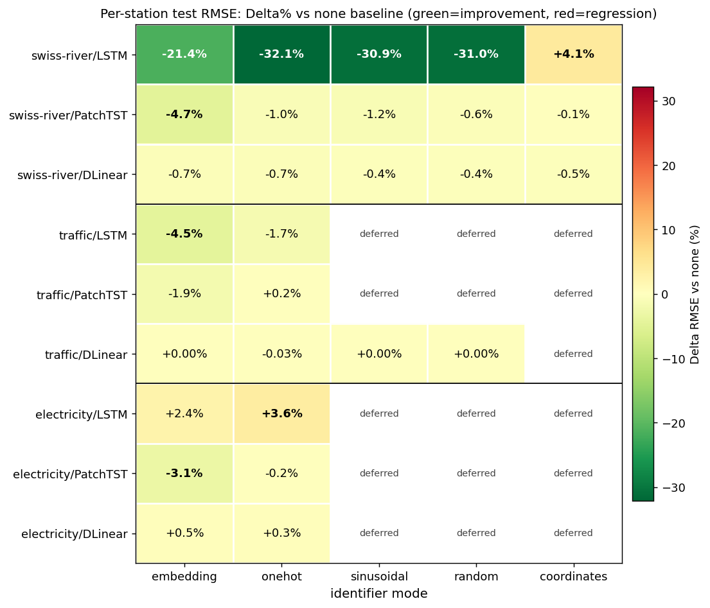

# Entity Identifiers for Time-Series Forecasting — Progress Report

_Advisor update · 2026-05-15 · single-slide summary (+ speaker notes)_

> ⚠️ **Correction (2026-06-13) — `coordinates` rows are RETRACTED.**
> This snapshot's `coordinates` results (the `🔴 +4.1 %` LSTM cell in §2,
> its heatmap column, and §5.1) are **invalid**: a bug meant the coordinate
> identifier was fed an
> all-**zero vector** (the dataset topology that holds station `(x, y)` was
> never loaded under the matrix default `graph_mode='none'`, so
> `make_entity_features` silently zero-filled — measured `abs-max = 0.0` on
> 2026-06-11). The "raw lat/lon as unscaled features" explanation below is
> therefore also wrong — no coordinate ever reached the model. After the fix
> (real, min-max-normalized coordinates, commit `421f1e7`), `coordinates`
> **helps** the LSTM by ≈ −33 % vs `none` (1.155 vs 1.723 on 1990), not
> +4 %. The non-coordinate rows stand. Full corrected results:
> [`2026-06-13-swiss3dt-results.md`](2026-06-13-swiss3dt-results.md).
> Original text below is preserved unedited as the as-presented record.

> **One-line takeaway:** On Swiss-River-1990, attaching a near-zero-cost entity
> identifier to a plain LSTM cuts per-station RMSE by **up to 32 %** and lets a
> 55 K-parameter LSTM **outperform a 410 K-parameter PatchTST transformer** —
> evidence that an explicit identity signal can substitute for architectural
> complexity.

---

## 1 · Progress snapshot

| Dataset | LSTM | PatchTST | DLinear |
|---|---|---|---|
| **swiss-river-1990** | ✅ 6/6 modes | ✅ 6/6 modes | ✅ 6/6 modes |
| **traffic** | ✅ 3/3 (sin/rand deferred) | ✅ 3/3 (sin/rand deferred) | ✅ 5/5 modes |
| **electricity** | ✅ 3/3 (sin/rand deferred) | ✅ 3/3 (sin/rand deferred) | ✅ 3/3 (sin/rand deferred) |

- **36 / 36 cells** of the 3-mode preliminary matrix **complete** with *real*
  training (30-epoch budget, HPO 25–50 trials, early stopping). sin / random /
  coordinates for traffic + electricity are deferred (Phase 14 backfill).
- Pipeline correctness re-audited (`code-verifier`): real HPO search, real
  predictions, train/val/test disjoint — see §5.
- Three UBELIX tiers exercised (free `gratis`, free `preemptable`, paid
  `paygo` ≈ 2.4 CHF of a 10 CHF self-imposed cap) — see
  `docs/strategy/ubelix-cluster-tiers.md` + `ubelix-cost-ledger.md`.

## 2 · Headline result — full 3×3×6 matrix (per-station test RMSE, Δ% vs `none`)

Each cell shows the relative change in **per-station mean RMSE** versus the
`none` baseline. **Green = improvement, red = regression. Bold = best mode in
that row.**

| dataset | model (split) | `none` baseline | embedding | onehot | sinusoidal | random | coordinates |
|---|---|---|---|---|---|---|---|
| **swiss-river** | LSTM (per_entity) | 1.725 °C | −21.4 % | 🟢 **−32.1 %** | −30.9 % | −31.0 % | 🔴 +4.1 % ⚠️[R] |
| **swiss-river** | PatchTST (multi-ch) | 1.382 °C | 🟢 **−4.7 %** | −1.0 % | −1.2 % | −0.6 % | −0.1 % |
| **swiss-river** | DLinear (multi-ch) | 1.287 °C | **−0.7 %** | −0.7 % | −0.4 % | −0.4 % | −0.5 % |
| **traffic** | LSTM (multi-ch) | 0.0280 † | 🟢 **−4.5 %** | −1.7 % | _deferred_ | _deferred_ | N/A |
| **traffic** | PatchTST (multi-ch) | 0.0254 † | 🟢 **−1.9 %** | +0.2 % | _deferred_ | _deferred_ | N/A |
| **traffic** | DLinear (multi-ch) | 0.0315 † | +0.00 % | **−0.03 %** | +0.00 % | +0.00 % | N/A |
| **electricity** | LSTM (multi-ch) | 423.7 ‡ | 🔴 +2.4 % | 🔴 +3.6 % | _deferred_ | _deferred_ | N/A |
| **electricity** | PatchTST (multi-ch) | 354.6 ‡ | 🟢 **−3.1 %** | −0.2 % | _deferred_ | _deferred_ | N/A |
| **electricity** | DLinear (multi-ch) | 360.9 ‡ | +0.5 % | +0.3 % | _deferred_ | _deferred_ | N/A |

_Units: ° C for swiss-river (denormalised water temperature); † normalised
occupancy fraction for traffic; ‡ standardised power for electricity. Absolute
RMSE units differ by dataset — the **Δ%** column is the cross-comparable
signal._ `coordinates` is only meaningful for swiss-river (has lat/lon).

> ⚠️[R] **RETRACTED (2026-06-13):** the `coordinates +4.1 %` cell is a
> zero-vector artifact (see the correction banner at the top). Corrected:
> `coordinates` ≈ −33 % vs `none` on swiss-river-1990.

> ⚠️[R] The **`coordinates` column** of this heatmap is invalid (zero-vector
> bug, see top banner). Read it with that column greyed out; the corrected
> coordinate bars are in `2026-06-13-swiss3dt-results.md`.

**Cross-dataset signal (read the heatmap):**

1. **`PatchTST × embedding` is the only universally-effective cell** — −4.7 /
   −1.9 / −3.1 % across all three datasets. The native `add_after_patch`
   injection is the most **portable** identifier strategy.
2. **LSTM with identifiers is dataset-dependent**: massive gain on swiss-river
   (per_entity split, −32 %), moderate on traffic (multi-ch, −4.5 %),
   *regression* on electricity (+2.4 %). Identifiers help LSTM most when the
   split mode otherwise hides station identity.
3. **DLinear is essentially immune** on every dataset (all |Δ| ≤ 0.7 %). A
   purely linear model with channel-wise heads has no head-room to use the
   identity signal.
4. **`coordinates` regresses LSTM** (+4.1 %) — raw lat/lon as unscaled features
   acts as noise. Needs normalisation / a learned geo-encoder.
   > ⚠️[R] **RETRACTED (2026-06-13):** wrong — the input was an all-zero
   > vector (bug), not "unscaled lat/lon". Fixed → `coordinates` **helps**
   > (≈ −33 %). See top banner + `2026-06-13-swiss3dt-results.md`.
5. **`traffic × PatchTST × onehot` essentially neutral (+0.2 %).** Now that the
   cell finished, the pattern holds: PatchTST gains only via `embedding`
   (native `add_after_patch`); transparent identifiers on PatchTST barely move
   the needle on the largest dataset. The remaining sin/random/coordinates for
   traffic + electricity are deferred to Phase 14 backfill.

## 3 · Key message — identity ≈ complexity

**Best configuration of each model, on the *same* per-station test set:**

| Model | best mode | RMSE (°C) | NSE | #params |
|---|---|---|---|---|
| 🥇 **LSTM** | **one-hot** | **1.171** | **0.893** | **55 K** |
| 🥈 DLinear | embedding | 1.278 | 0.873 | 36 K |
| 🥉 PatchTST | embedding | 1.317 | 0.871 | 410 K |
| _LSTM (no identifier)_ | _none_ | _1.725_ | _0.699_ | _55 K_ |

- A **plain LSTM + one-hot identifier beats the PatchTST transformer by 11 %**
  RMSE — at **1/7 the parameter count**.
- Without the identifier the *same* LSTM is the **worst** model (RMSE 1.725).
  The identifier alone — not the architecture — flips it from last to first.
- **Interpretation (hypothesis):** when a model is given an explicit "which
  entity am I?" signal, it no longer has to *infer* identity from the dynamics,
  freeing capacity for the actual forecasting task. A cheap identifier can do
  the job that motivates much heavier architectural machinery.

## 4 · What an identifier is, and how each model receives it

### 4.1 The identifier modes (definitions)

For a dataset with `N` entities (stations), entity `i ∈ {0,…,N−1}` with id
string `s_i`. An identifier mode maps `i` to a feature vector `id(i)`:

| Mode | Definition | Dim | Learned? |
|---|---|---|---|
| `none` | `id(i) = ∅` — no entity feature (baseline) | 0 | — |
| `onehot` | `id(i) = e_i`, `e_i[j] = 𝟙[j = i]` | `N` | no |
| `sinusoidal` | `id(i)[k] = sin(i·ω_k)`, `id(i)[D/2+k] = cos(i·ω_k)`, `ω_k = exp(−k·ln(10000)/(D/2−1))` | `D`(=16) | no |
| `random` | `id(i) = v_i / ‖v_i‖`, `v_i ∼ 𝒩(0,I_D)` drawn with per-station seed `SHA256(seed‖s_i)` | `D`(=16) | no |
| `coordinates` | `id(i) = (lat_i, lon_i)` — geographic position | 2 | no |
| `embedding` | `id(i) = E[i]`, `E ∈ ℝ^{N×d}` a lookup table trained end-to-end by SGD | `d`(=10) | **yes** |

- `onehot / sinusoidal / random / coordinates` are **transparent**: fixed
  vectors, **zero learned parameters** — the cheapest possible intervention.
  `sinusoidal` is the Transformer positional encoding applied to the station
  *index*; `random` is a fixed hash-seeded vector (its near-equal performance
  to `onehot` shows the gain is from *disambiguation*, not ID semantics).
- `embedding` is the **only learned** identifier.
- The chosen `id(i)` is concatenated to the model input `x_enc`; for
  `embedding` an `EntityWrapper` concatenates then linearly projects back to the
  original `enc_in` so the inner model's shape is unchanged.

### 4.2 `per_entity` vs `multi_channel` — two ways to lay out N entities

| | `per_entity` (LSTM here) | `multi_channel` (PatchTST, DLinear here) |
|---|---|---|
| One training sample | `(x ∈ ℝ^{T×F}, y ∈ ℝ^{H×1})` for **one** station | `(x ∈ ℝ^{T×N}, y ∈ ℝ^{H×N})` — **all** N stations stacked as channels |
| Does the model see other stations? | **No** — one station per forward pass | **Yes** — all stations jointly, channel `c` = station `c` |
| Where does identity come from? | **Only** from `id(i)` — otherwise the station is anonymous | Implicit in the channel index already |

This is the crux of §3: in `per_entity` the identifier supplies the *only*
identity signal, so it helps enormously (LSTM −32 % RMSE); in `multi_channel`
the channel layout already encodes identity, so an explicit identifier is
largely redundant (PatchTST/DLinear ≤5 % RMSE).

### 4.3 Injection point per model

| Model | Embedding mode | Transparent modes |
|---|---|---|
| **LSTM** | `EntityWrapper`: station ID → `nn.Embedding` → concat → linear-project back to `enc_in` | station feature vector concatenated into `x_enc` at the data layer |
| **PatchTST** | **native** `add_after_patch`: identifier embedding added to patch tokens after patch embedding | `ChannelTransparentWrapper`: per-channel feature fused before the backbone |
| **DLinear** | `ChannelEntityWrapper`: per-channel learned embedding fused into the linear head | `ChannelTransparentWrapper`: per-channel static feature fused |

## 5 · Reading the results — why some cells don't move

1. **`coordinates` hurts LSTM (+4 % RMSE).** Raw lat/lon fed as two unscaled
   features — large-magnitude, low-information columns that act as noise. Needs
   normalisation / a learned geo-encoder before it can help. *(actionable fix)*
   > ⚠️[R] **RETRACTED (2026-06-13):** the diagnosis was wrong — coordinates
   > were never loaded (zero vector), not "unscaled". The actionable fix
   > (load topology + min-max normalize, `421f1e7`) is done; `coordinates`
   > now helps the LSTM (≈ −33 %).
2. **PatchTST & DLinear barely move (≤5 % RMSE).** In `multi_channel` split
   every station is already its own channel, so channel identity is *implicit*
   in the layout — an explicit identifier is largely redundant (best case is
   PatchTST × embedding at −4.7 %; all other multi-channel cells ≤1.2 %).
   Identifiers pay off most where identity is **otherwise invisible**
   (LSTM `per_entity`).
3. **`random` ≈ `one-hot` (−31 % vs −32 % RMSE).** A hash-derived random vector
   helps almost as much as one-hot — the *gain comes from disambiguating
   stations*, not from any semantic content of the ID.
4. **Caveat (honest):** LSTM runs in `per_entity`, PatchTST/DLinear in
   `multi_channel` — the cross-model comparison is *confounded by split mode*.
   The single-seed budget also means no significance band yet. A controlled
   `per_entity`-for-all-models run is the cleanest follow-up.

## 6 · Next steps

- **Finish the matrix:** traffic × {LSTM, PatchTST}, electricity × 3 models
  (12 cells remaining; running now via resumable cluster jobs).
- **Controlled comparison:** re-run PatchTST/DLinear in `per_entity` to remove
  the split-mode confound.
- **Multi-seed** (≥3) for the headline cells → significance bands.
- ~~**Fix `coordinates`:** normalise + try a small geo-MLP encoder.~~
  ✅ **Done (2026-06-13):** the regression was a zero-vector bug, not
  scaling; fixed by loading topology + min-max normalization (`421f1e7`).
  `coordinates` now helps (≈ −33 %).
- Ablation: parameter-matched baseline (does the `EntityWrapper`'s extra linear
  layer explain part of the embedding gain?).

---

## Speaker notes — how to present this elegantly

**Slide layout (single slide, top-to-bottom):**

1. **Title bar** — the one-line takeaway in 1 sentence. Lead with the number
   (−32 % RMSE, 11 %, 1/7 params).
2. **Left 60 %** — the §2 heatmap (`results-heatmap-all.png`). It is the whole
   3×3×6 story in one picture: the top-left dark-green block (swiss-river LSTM)
   carries the headline, the green `embedding` column shows PatchTST's
   cross-dataset consistency, and the orange electricity-LSTM cells expose the
   only systematic regression. Draw the eye to those three regions.
3. **Right 40 %** — the §3 "identity ≈ complexity" 4-row table (swiss-river,
   the cleanest cut). Bold the LSTM one-hot row; grey out the LSTM `none` row
   so the *flip* is visible.
4. **Footer strip** — one line for the §5 caveat (split-mode confound,
   single-seed). Showing the caveat up front earns credibility with an advisor.

**Delivery tips:**
- Open with the *flip*: "same LSTM, worst → best, the only change is a free
  identifier." That is the memorable hook.
- Use **per-station RMSE in °C**, not normalised MSE — physically meaningful
  ("≈1.2 °C error") and apples-to-apples across split modes.
- Keep the §4 injection table as a **backup slide** — show only if asked
  "how does the identifier get in?".
- State the next-step list as 3 bullets max on screen; the rest is talk-track.
- Honesty framing: present "identity ≈ complexity" as a **hypothesis the data
  supports**, not a proven theorem — the confound caveat is your shield.

**Tooling:** this Markdown converts cleanly to slides via Marp or Pandoc
(`pandoc -t pptx`). The bar chart is the only required figure.
