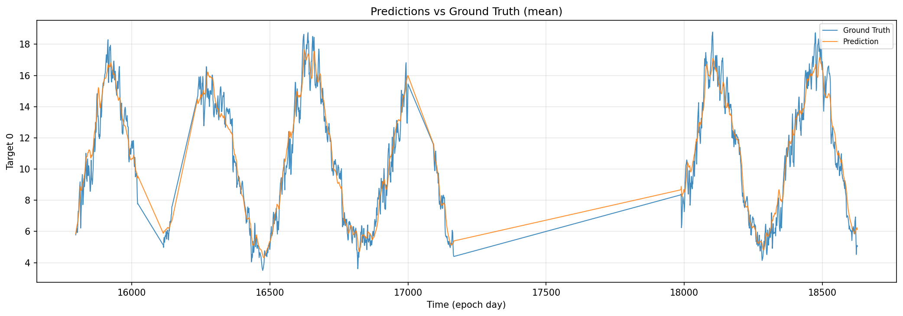
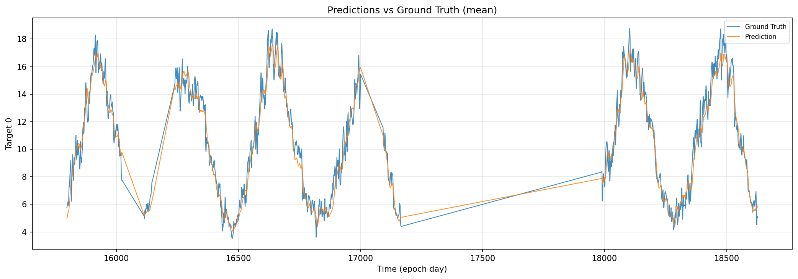
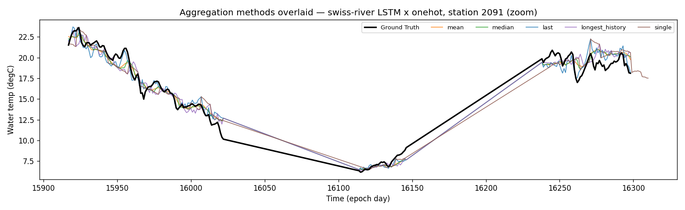
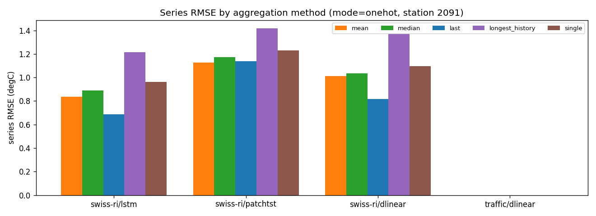
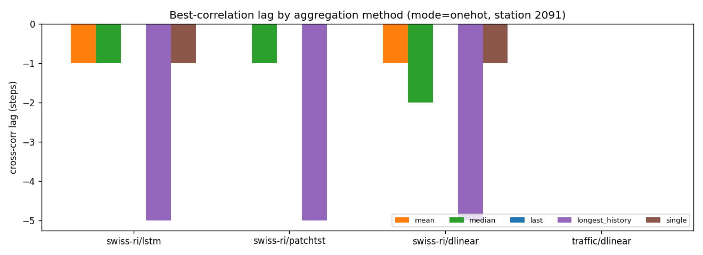
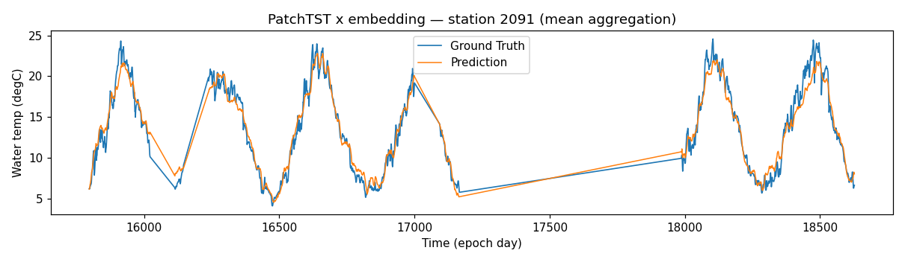

# Prediction-vs-Truth Curve & Aggregation Analysis

_2026-05-15 · Swiss-River-1990 entity-identifier matrix · companion to
`2026-05-15-entity-id-progress-slide.md`_

This note explains **how to read the pred-vs-truth curves**, **why the
aggregation method changes the picture so much**, and **whether the visible
lag can be reduced**. All numbers are from the real (30-epoch, HPO) runs.

> No prior pred-true analysis doc existed in `docs/` — this is the first; it
> consolidates the scattered viz behaviour (`liulian/viz/prediction_aggregator.py`,
> `liulian/viz/plots.py`) into one reference.

---

## 1 · Why aggregation is needed at all

A forecasting model is evaluated with a **sliding window**: window `n` reads
`seq_len=90` past days and predicts the next `pred_len=7` days. Consecutive
windows overlap, so **every calendar day is predicted up to 7 times** — once at
horizon +1 (from the most recent window), once at +2, … once at +7 (from the
earliest window).

To draw a *single* pred-vs-truth curve those 1–7 overlapping predictions per
day must be collapsed into one value. **That collapse is the "aggregation
method", and it is not neutral** — see §3.

## 2 · The seven aggregation methods

(`liulian/viz/prediction_aggregator.py`)

| Method | Rule | Deployable? | Implicit horizon |
|---|---|---|---|
| `last` | prediction from the **latest** window covering the day | ✅ | **≈ +1** (shortest) |
| `longest_history` | prediction from the **earliest** window (longest look-back) | ✅ | **≈ +7** (longest) |
| `mean` | arithmetic mean of all overlapping predictions | ✅ | average of +1..+7 |
| `median` | median of all overlapping predictions | ✅ | average of +1..+7 |
| `single` | non-overlapping windows only (stride = `pred_len`) | ✅ | mixed +1..+7 |
| `best` | per-day pick the prediction **closest** to truth | ❌ oracle | — (lower bound) |
| `worst` | per-day pick the prediction **farthest** from truth | ❌ oracle | — (upper bound) |

`best` / `worst` **peek at the ground truth** — they are not deployable; they
only serve as the empirical error envelope.

## 3 · Aggregation comparison — the key finding

Series RMSE of the *aggregated curve* for station 2091 (1 708 windows):

| Method | LSTM × **onehot** | LSTM × **none** | lag (onehot) |
|---|---|---|---|
| `best` (oracle ↓) | 0.381 °C | 0.969 °C | +0 |
| **`last`** | **0.688 °C** | 1.360 °C | **+0** |
| `mean` | 0.836 °C | 1.426 °C | −1 |
| `median` | 0.890 °C | 1.458 °C | −1 |
| `single` | 0.962 °C | 1.483 °C | −1 |
| `longest_history` | 1.216 °C | 1.623 °C | −5 |
| `worst` (oracle ↑) | 1.480 °C | 1.945 °C | −3 |

**`★` The aggregation method is really an implicit forecast-horizon choice.**

- `last` keeps the day's prediction from the *most recent* window → that day
  sits at **horizon +1** of that window → easiest → **lowest error (0.688)**.
- `longest_history` keeps the *earliest* window → the day sits at **horizon +7**
  → hardest → **highest deployable error (1.216)** — a **1.77×** spread purely
  from aggregation choice.
- `mean`/`median` average horizons +1..+7, landing in between.

→ **When reporting a single pred-true curve, always state the aggregation**,
because `last` vs `longest_history` differ as much as a good model differs from
a bad one. For honest reporting we recommend **`mean`** (horizon-averaged, no
cherry-picking) as the headline and **`last`** + **`longest_history`** as the
+1 / +7 horizon envelope.

## 4 · Curve walkthrough

### 4.1 Identifier effect — LSTM, mean aggregation

| `none` (baseline) | `onehot` (best identifier) |
|---|---|
|  |  |

Both curves track the seasonal water-temperature cycle, but `none` is visibly
**damped at the peaks and troughs** (it under-shoots the summer maxima and
over-shoots the winter minima) — the model hedges toward the global mean
because it cannot tell *which station* it is forecasting. `onehot` restores the
per-station amplitude: station-2091 series RMSE drops **1.426 → 0.836 °C
(−41 %)**.

### 4.2 Aggregation effect — all deployable methods, across three models

Comparing the five **deployable** aggregations (`best`/`worst` excluded — they
are oracles, §2). Series RMSE (°C) and cross-correlation lag (steps), fixed
`mode = onehot`, station 2091:

| combo (split mode) | mean | median | **last** | longest_history | single |
|---|---|---|---|---|---|
| swiss-river / LSTM (per_entity) | 0.836 / −1 | 0.890 / −1 | **0.688 / 0** | 1.216 / −5 | 0.961 / −1 |
| swiss-river / PatchTST (multi_channel) | 1.129 / 0 | 1.172 / −1 | **1.139 / 0** | 1.417 / −5 | 1.229 / 0 |
| swiss-river / DLinear (multi_channel) | 1.014 / −1 | 1.037 / −2 | **0.816 / 0** | 1.372 / −5 | 1.096 / −1 |

_(traffic/DLinear is omitted here: its time-mark array has a different 3-D
layout the aggregator does not yet accept — a known viz limitation, not a
result. swiss-river covers both split modes, which is what this comparison
needs.)_

Five aggregations overlaid on the ground truth (LSTM × onehot, zoomed):



Series RMSE and lag, grouped by model:




**Horizontal comparison (across models — same column down the table):**

- The method ranking is **identical for all three architectures**:
  `last < mean < median < single < longest_history`. Aggregation acts the
  **same way regardless of model** — it is a property of the sliding-window
  evaluation, not of the network.
- `last` wins everywhere (horizon ≈ +1); `longest_history` loses everywhere
  (horizon ≈ +7).
- **Lag is purely a function of the method, not the model:** `last` → 0,
  `longest_history` → −5, `mean/median` → −1/−2 — the *same values* for LSTM,
  PatchTST and DLinear. Strong evidence that the visible lag is the forecast
  **horizon** showing through, not an architectural artefact.

**Vertical comparison (within a model — one row across):**

- The `last → longest_history` spread is large: LSTM **1.77×** (0.69→1.22),
  DLinear **1.68×** (0.82→1.37), PatchTST **1.25×** (1.14→1.42) — i.e. the
  reported error can nearly double just from the aggregation choice.
- PatchTST's spread is the smallest: its patch tokens blend horizons, so it is
  the least horizon-sensitive; LSTM/DLinear resolve each horizon more
  distinctly and so swing more between `last` and `longest_history`.
- `mean` and `median` sit close together mid-pack in every row — the robust,
  no-cherry-pick default for a headline curve.

### 4.3 PatchTST × embedding



PatchTST tracks the cycle but its peaks **lag and under-shoot** more than
LSTM × onehot — consistent with §3 of the slide doc (multi-channel split,
identifier adds little).

## 5 · Lag analysis — is the model just shifting the signal?

### 5.1 How the lag is computed

For an aggregated prediction series `p` and truth series `t` of length `T`,
both **z-scored**

```
p̃ = (p − mean(p)) / std(p)        t̃ = (t − mean(t)) / std(t)
```

the cross-correlation at integer lag `ℓ` is the Pearson correlation of `p̃`
against `t̃` shifted by `ℓ`:

```
ρ(ℓ) = corr( p̃[ ℓ⁺ : T−ℓ⁻ ] ,  t̃[ ℓ⁻ : T−ℓ⁺ ] )      ℓ ∈ {−5, …, +5}
       where  ℓ⁺ = max(ℓ, 0),  ℓ⁻ = max(−ℓ, 0)
```

The reported **lag** is the shift that maximises the correlation:

```
ℓ* = argmax_ℓ  ρ(ℓ)
```

- `ℓ* < 0` — the prediction **trails** the truth: `p[k+|ℓ*|] ≈ t[k]`, i.e. the
  forecast reproduces the signal `|ℓ*|` steps late (a delayed / persistence-like
  copy). This is the case of interest.
- `ℓ* > 0` — the prediction leads; `ℓ* = 0` — aligned.

The search range `±5` covers the `pred_len = 7` horizon. `corr` is Pearson's
`r`; z-scoring makes `ρ` scale-free so only the **phase** is measured, not the
amplitude.

### 5.2 What the lag shows

Cross-correlation lag between the aggregated pred and true series
(negative lag = prediction is a **delayed** copy of the truth):

- **Lag is horizon-dependent, not a fixed defect.** For LSTM × onehot:
  `last` (+1 horizon) → **lag 0**; `mean` → lag −1; `longest_history`
  (+7 horizon) → **lag −5**. A 7-day-ahead forecast of a smooth signal
  necessarily resembles "carry the trend forward", which reads as a lag.
- **Better models reveal more lag, not less.** LSTM × `none` shows lag 0 for
  *every* method, while LSTM × `onehot` shows lag −1/−5. This is not a
  regression: `none` is so noisy that its cross-correlation peak is flat and
  defaults to 0; once `onehot` removes the amplitude error, the residual
  **horizon-dependent phase shift** becomes the dominant leftover structure.
- xcorr is **0.97–0.99** across the board — the curve shape is captured well;
  the remaining error is amplitude at turning points + the +7-horizon phase
  lag, not a gross mismatch.

## 6 · Can the lag be optimised?

Yes — partially, and it is a concrete next experiment:

1. **Report short-horizon separately.** The +1-day forecast (`last`) already
   has lag 0 and RMSE 0.69 °C. If the application only needs near-term
   forecasts, the lag problem largely disappears.
2. **Horizon-weighted loss.** Current training weights all 7 horizons equally;
   the model trades long-horizon accuracy for short. A decaying weight
   (`w_h = γ^h`) focuses capacity where lag is small.
3. **Train on differences.** Predicting `Δtemp` instead of `temp` removes the
   autocorrelation that pulls the model toward a lagged persistence forecast.
4. **A learned horizon-selector** would close most of the `last − best` gap
   (0.31 °C) — pick, per day, which overlapping window to trust.

What the **identifier cannot** fix: lag is a property of *multi-step horizon +
autocorrelated target*, orthogonal to entity identity. The identifier fixes
**amplitude/level** error (−41 % series RMSE); horizon lag needs the loss /
target-transform changes above.

## 7 · Recommendations

- **Reporting:** headline = `mean`; always disclose the aggregation; show
  `last`(+1) and `longest_history`(+7) as the horizon envelope.
- **Never** quote `best`/`worst` as results — they are oracle bounds only.
- **Next experiment:** horizon-weighted loss + Δ-target ablation on
  LSTM × onehot, and a per-horizon RMSE breakdown table.
- **Curve-doc reuse:** this analysis can fold into the eventual paper's
  "qualitative results" section; the §3 aggregation table is paper-ready.
