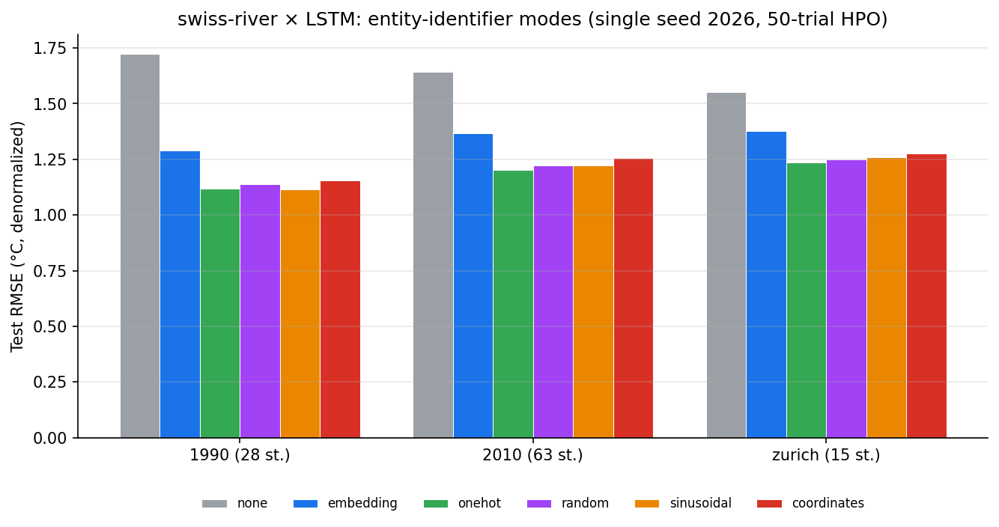
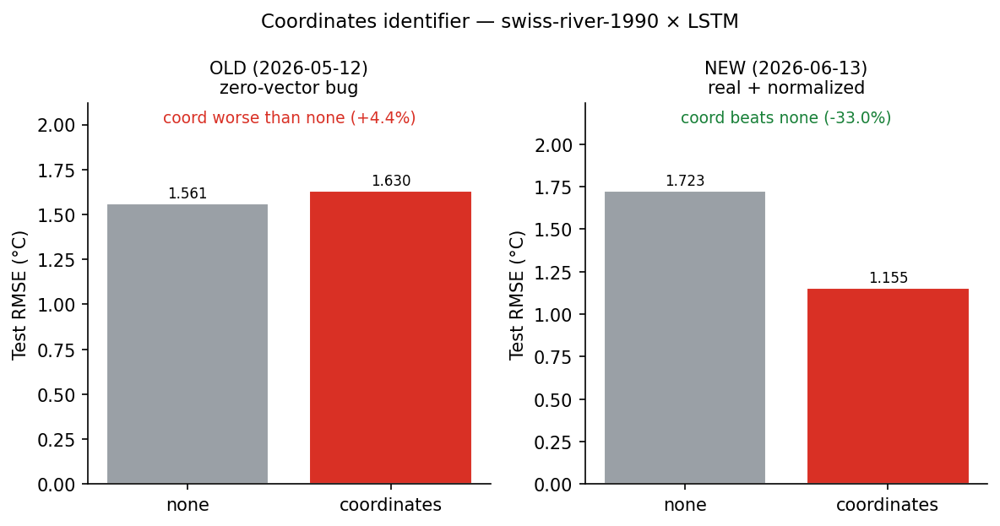

# swiss-river × LSTM entity-identifier results (swiss3dt, 2026-06-13)

Per-entity LSTM on three Swiss river-temperature datasets, six identifier
modes, **single seed 2026**, 50-trial Ray HPO per cell, dropout tuned
`{0, 0.1}`, batch_size 32 (fixed), 30 epochs, per-trial deterministic
seeding, single chronological 80/20 hold-out (no CV).

Numbers are read straight off the run `results.json` files by
`tools/plot_swiss3dt_results.py` (no hand-copied values). Raw table:
`figures/swiss3dt-2026-06-13/swiss3dt-rmse.csv`.

## Results — test RMSE (°C, denormalized)



| dataset (stations) | none | embedding | onehot | random | sinusoidal | coordinates |
|---|---|---|---|---|---|---|
| 1990 (28) | 1.723 | 1.289 | 1.119 | 1.139 | **1.116** | 1.155 |
| 2010 (63) | 1.642 | 1.368 | **1.201** | 1.222 | 1.224 | 1.255 |
| zurich (15) | 1.553 | 1.378 | **1.237** | 1.249 | 1.259 | 1.276 |

Best HPO picks per cell (d_model / e_layers / dropout / identifier-dim) and
the artifact-level verification of the tuned dims live in the task ledger
(`liulian-docs/docs/tasks/liulian-python/2026-06.md`, 2026-06-13).

## What we can and cannot claim (research-critic audit)

**Defensible (single seed):**

- Every identifier mode beats the `none` baseline by a large margin —
  embedding ≈ −20 to −25 %, the four transparent modes ≈ −19 to −35 %,
  consistently across all three datasets.
- Embedding and the transparent modes are the strongest; the transparent
  modes sit a touch lower in RMSE than embedding on every dataset.

**NOT claimed (insufficient evidence):**

- *"Transparent identifiers outperform learned embeddings."* The gap
  (e.g. 1.289 vs 1.116 on 1990) is from a **single seed** with no variance
  estimate; it may not exceed run-to-run noise.
- *Any ranking among the four transparent modes.* They fall within
  ~0.04 °C of each other — not separable at one seed.
- *Generalization beyond Swiss river temperature.* All three datasets are
  the same domain.

**Known confound:** transparent modes concatenate the identifier block to
`x_enc`, enlarging `enc_in` and hence the LSTM input weights (random
≈ 55 k params vs embedding ≈ 51 k vs none ≈ 51 k). "Identifier type" is
entangled with input capacity. A capacity-matched control is needed before
attributing the gain purely to the identifier.

**To harden** (tracked as task #32): ≥3 seeds with mean ± std and a paired
test; a capacity-matched `none` control (widen `enc_in` with random /
padding channels).

## Coordinates: why it flipped from "hurts" to "helps"



The 2026-05 matrix reported `coordinates` as **regressing** the LSTM. On
swiss-river-1990 × LSTM the old run (`swissriver-lstm-REAL-20260512`, the
batch the advisor slide used — its onehot 1.1717 matches the slide's 1.171)
gave coord 1.630 vs none 1.561 (**+4.4 %** — worse than no identifier). The
new run gives coord 1.155 vs none 1.723 (**−33 %** — a clear benefit). The
two `none` baselines are at a similar level (1.561 vs 1.723), so the flip is
in the coordinate effect itself, and the cause is a fixed bug:

- **Old = zero-vector bug.** The identifier-matrix default is
  `graph_mode='none'`, and the old code only loaded the dataset topology
  (which carries the station `(x, y)` from the graph file) when a graph
  mode was active. So `coordinates` received an **empty** coordinate map
  and `make_entity_features` fell back to `torch.zeros(2)` — every station
  got the same zero vector. Measured directly on 2026-06-11: the coordinate
  channels had `abs-max = 0.0`. The 2026-05 slide's description of "raw
  lat/lon as unscaled features" was wrong — no coordinate ever reached the
  model. With two constant-zero channels, `coordinates` was effectively
  `none` plus a useless widening, hence ≈ none / slightly worse.
- **New = real, normalized coordinates** (commit `421f1e7`). Three changes:
  1. load the topology whenever `identifier_mode='coordinates'` (not only
     for graph modes), so the `(x, y)` map is actually populated;
  2. min-max normalize coordinates per dimension over the dataset's own
     stations (raw CH1903 metres are ~1e5–1e6 and would dwarf the scaled
     inputs);
  3. raise instead of silently zero-filling when a coordinate is missing
     (no-fake-features rule).

So the flip is not a modelling surprise — the old "coordinates hurt"
finding was an artifact of a silent zero-feature bug, and is **retracted**.
The 2026-05 slide/analysis should be annotated accordingly (task #29).

## Reproduce

```bash
# regenerate figures + CSV from the local result artifacts
python tools/plot_swiss3dt_results.py
```
