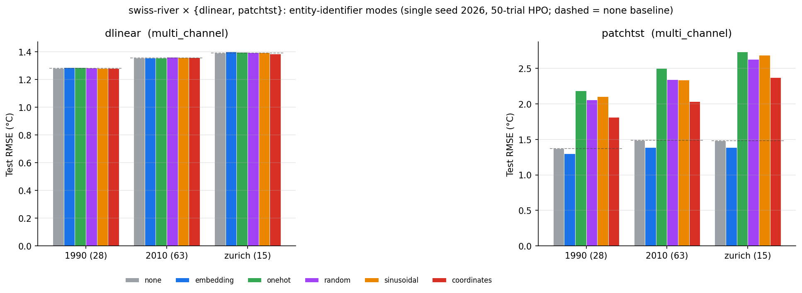

# swiss-river × {DLinear, PatchTST} entity-identifier results (multi_channel, 2026-06-14)

DLinear and PatchTST on the three Swiss datasets in **multi_channel** split
(each station is a channel — identity is already implicit in the channel
layout, unlike the per_entity LSTM where the identifier is the *only*
identity signal). Single seed 2026, 50-trial HPO per cell, batch_size fixed
32, 30 epochs. Numbers read from real `results.json` by
`tools/plot_swiss_mc_results.py` (no hand-copied values);
CSV: `figures/swiss-mc-2026-06-14/swiss-mc-rmse.csv`.

> These results only became measurable after fixing four multi_channel bugs
> on 2026-06-14 (commits `fdecec1`, `82f0903`): before that, the transparent
> identifier modes were a silent no-op (== none) and the 2010/zurich cells
> were all-NaN. The 2026-05 dlinear/patchtst transparent results are
> **retracted** (they measured the no-op).

## Results — test RMSE (°C, denormalized)



| model | dataset | none | embedding | onehot | random | sinusoidal | coordinates |
|---|---|---|---|---|---|---|---|
| DLinear | 1990 | 1.281 | 1.286 | 1.286 | 1.283 | 1.282 | 1.279 |
| DLinear | 2010 | 1.355 | 1.356 | 1.356 | 1.361 | 1.358 | 1.357 |
| DLinear | zurich | 1.391 | 1.401 | 1.396 | 1.393 | 1.393 | 1.385 |
| PatchTST | 1990 | 1.374 | **1.304** | 2.189 | 2.059 | 2.108 | 1.815 |
| PatchTST | 2010 | 1.488 | **1.387** | 2.505 | 2.345 | 2.340 | 2.036 |
| PatchTST | zurich | 1.480 | **1.388** | 2.738 | 2.631 | 2.690 | 2.377 |

## What we can and cannot claim (research-critic audit)

**Defensible (single seed; val mirrors test, so not overfitting):**

- **DLinear shows no measurable identifier effect** on swiss multi_channel:
  all six modes land within ~1% of `none` on every dataset (HPO val is
  equally flat, e.g. 1990 val 0.1103–0.1105 across modes). A linear
  decomposition model over channels has no head-room to exploit per-channel
  identity, and the wrapper's fusion projection adds none.
- **On PatchTST, the injection POINT — not the identifier type — drives the
  result.** `embedding` via `add_after_patch` (injected *after* patch
  embedding) helps (~−5% vs none). The transparent modes, injected via
  `concat_to_x` + `ChannelTransparentWrapper`'s per-channel
  `Linear(1+D,1)` fusion *before* patching, hurt substantially (+30–60%),
  and they hurt in HPO val too (1990 onehot val 0.231 vs none 0.124).

**NOT claimed (would over-reach):**

- *"Transparent identifiers are harmful."* Too broad — `embedding` is also
  an identifier and it helps. What hurts on PatchTST is the **pre-patch
  `concat_to_x` fusion**, which perturbs the per-channel series that
  PatchTST then slices into patch tokens. `add_after_patch` avoids this.
- *"DLinear is immune to identity."* We observe no effect; we cannot tell
  apart "the linear model can't use identity" from "the fusion projection
  discards it" without inspecting the projection weights.
- Anything cross-domain — all three datasets are Swiss water temperature.

**Key caveat (read before citing):** the multi_channel transparent results
reflect the behaviour of **`ChannelTransparentWrapper`** (concat + learnable
per-channel fusion projection), *not* the intrinsic value of the identifier
information. This wrapper is structurally different from the per_entity
`EntityTransparentWrapper` (zero-parameter concat). Cross-split comparisons
must account for this.

## Contrast with the per_entity LSTM (2026-06-13)

| split | model | identifier effect |
|---|---|---|
| per_entity | LSTM | every identifier helps (−25 to −35% vs none) — identity is the ONLY identity signal |
| multi_channel | DLinear | none (≈ flat) — identity already in the channel layout |
| multi_channel | PatchTST | `add_after_patch` embedding helps; pre-patch transparent injection hurts |

The dominant variable across these is the **split mode**, not the model:
per_entity makes each sample identity-blind (so the identifier is decisive),
while multi_channel already encodes identity in the channel index (so an
extra identifier is at best redundant, at worst disruptive to the
architecture). This matches the split-mode confound flagged in the 2026-05
report.

## To harden / explain (follow-ups)

- **Ablation isolating injection point from identifier type**: run PatchTST
  + transparent + `add_after_patch` — if it stops hurting, the cause is the
  pre-patch fusion, confirming the audit's reading.
- **Inspect the DLinear fusion-projection weights** to tell "can't use" from
  "discards".
- **Multi-seed** (≥3) for variance bands (shared with the lstm follow-up #32).

## Reproduce

```bash
python tools/plot_swiss_mc_results.py
```
